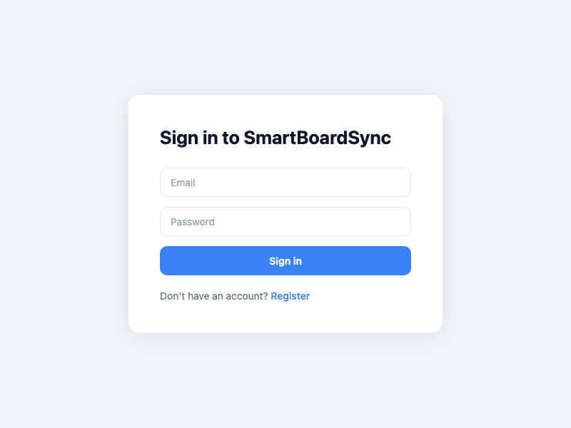
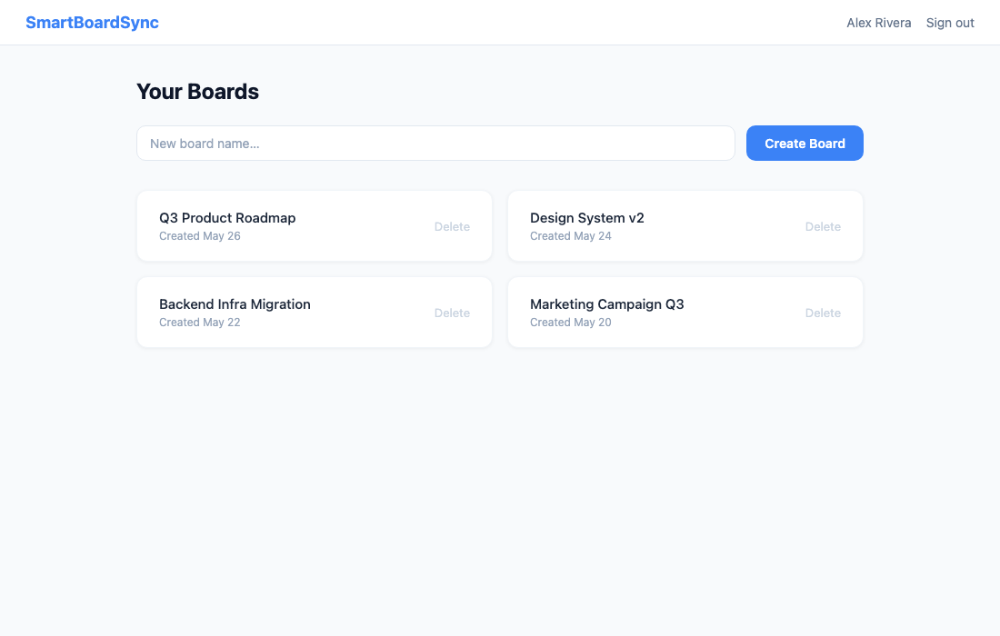
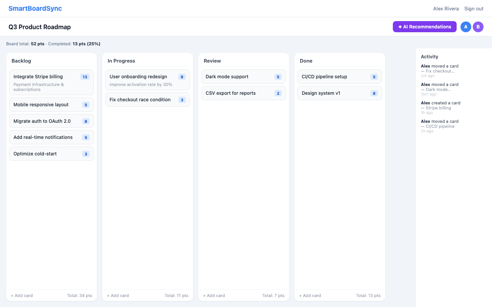
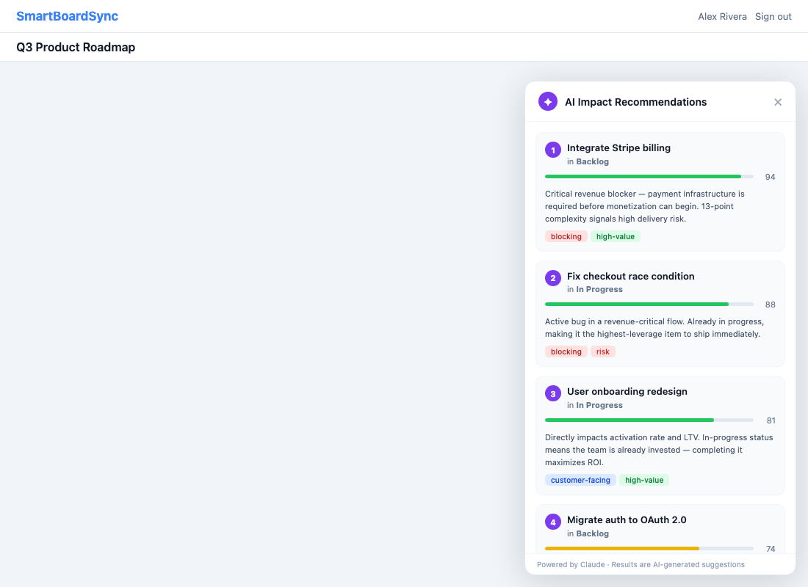

# SmartBoardSync

A real-time collaborative Kanban board with AI-powered story prioritization, built with React, Node.js, Socket.io, and PostgreSQL.

---

## Screenshots

### Sign In


### Dashboard — Your Boards


### Board View


### AI Impact Recommendations


---

## Features

- **Real-time collaboration** — Multiple users see card moves, creates, and deletes instantly via Socket.io
- **Drag-and-drop** — Reorder cards within and across columns using @dnd-kit; positions stored as floats with automatic rebalancing
- **Optimistic conflict resolution** — Timestamp-based conflict detection rejects stale moves; card locking prevents concurrent edits
- **AI Impact Recommendations** — One-click panel powered by Claude that ranks your backlog by business impact, with per-card explanations, impact scores (0–100), and tags like `blocking`, `high-value`, `quick-win`, `technical-debt`, and `risk`
- **Story points** — Fibonacci scale (1, 2, 3, 5, 8, 13) per card with per-column and per-board totals
- **Activity log** — Live sidebar showing recent card moves and creates
- **Presence indicators** — Colored avatars show who else is viewing the same board
- **JWT authentication** — Secure login and registration with bcrypt password hashing

---

## Tech Stack

| Layer | Tech |
|---|---|
| Frontend | React 18, Vite, Tailwind CSS, @dnd-kit, Zustand |
| Backend | Node.js, Express 5, Socket.io 4 |
| Database | PostgreSQL 15 |
| AI | Anthropic Claude (claude-opus-4-5) via `@anthropic-ai/sdk` |
| Auth | JWT + bcrypt |

---

## Getting Started

### Prerequisites

- Node.js 18+
- PostgreSQL 15
- An [Anthropic API key](https://console.anthropic.com/) for the AI recommendations feature

### 1. Clone the repo

```bash
git clone https://github.com/kmesfun/SmartBoardSync.git
cd SmartBoardSync
```

### 2. Set up the database

```bash
createdb boardsync
```

### 3. Configure the server

```bash
cd server
cp .env.example .env   # then edit .env
```

Edit `server/.env`:

```env
DATABASE_URL=postgresql://localhost:5432/boardsync
JWT_SECRET=your_secret_here
PORT=4000
CLIENT_ORIGIN=http://localhost:5173
ANTHROPIC_API_KEY=sk-ant-...   # required for AI recommendations
```

### 4. Install dependencies and initialize the schema

```bash
# Server
cd server
npm install
npm run db:init

# Client
cd ../client
npm install
```

### 5. Start the development servers

```bash
# Terminal 1 — API + Socket.io server
cd server && npm run dev

# Terminal 2 — Vite dev server
cd client && npm run dev
```

Open [http://localhost:5173](http://localhost:5173) in your browser.

---

## AI Recommendations

Click the **✦ AI Recommendations** button in any board's header to open the impact panel.

The panel calls `GET /api/recommendations/:boardId`, which:

1. Fetches all cards on the board (title, column, story points)
2. Sends them to **Claude** with a structured prompt asking for the top 5 highest-impact stories
3. Returns each recommendation with:
   - **Rank** (1–5)
   - **Impact score** (0–100)
   - **Reason** — a plain-English explanation of why this story matters most right now
   - **Tags** — `blocking`, `high-value`, `quick-win`, `technical-debt`, `risk`, `customer-facing`, `complex`

The AI considers blockers, business value, in-progress momentum, technical risk, and complexity when ranking stories.

---

## Project Structure

```
SmartBoardSync/
├── client/
│   └── src/
│       ├── components/
│       │   ├── Board.jsx            # Main board with columns
│       │   ├── Card.jsx             # Draggable card with lock overlay
│       │   ├── Column.jsx           # Column with drop zone
│       │   ├── AIRecommendations.jsx # Slide-in AI panel
│       │   └── ActivityLog.jsx      # Live activity sidebar
│       ├── hooks/
│       │   └── useSocket.js         # Socket.io event wiring
│       ├── store/
│       │   └── boardStore.js        # Zustand store
│       └── lib/
│           └── socket.js            # Lazy singleton socket
└── server/
    └── src/
        ├── routes/
        │   ├── auth.js              # POST /api/auth/register|login
        │   ├── boards.js            # CRUD for boards
        │   ├── cards.js             # CRUD + move for cards
        │   └── recommendations.js  # GET /api/recommendations/:boardId
        ├── db/
        │   ├── schema.sql           # PostgreSQL schema
        │   └── queries/             # Parameterized query functions
        ├── middleware/
        │   └── auth.js              # JWT verify middleware
        └── server.js                # Express + Socket.io setup
```

---

## Running Tests

```bash
cd server && npm test
```

Server tests use `--runInBand` (sequential) to avoid shared-email conflicts between test files.

---

## License

MIT
